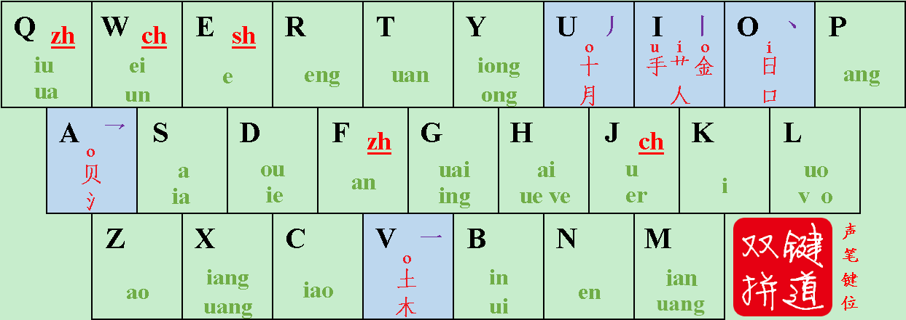

# 方案介绍

小小星空内置了 4 个星空系列编码方案（星空键道、星空一笔、星空二笔、星空星笔）。

本章简单介绍用户最多的「星空键道方案」，供快速入门。已经安装了小小星空的用户，可以在[用户配置目录](/usage-custom#用户配置目录)的 doc 目录下，找到更多的学习资料。

## 星空键道方案速成教程

::: tip 在线练习
你可以在 [KeyTao在线练习](https://keytao.rea.ink/practice)网站快速体验星空键道方案。
:::

### 单字输入

星空键道6（以下简称键道）是一种音形码方案，其单字编码由音码和形码组成。音码部分是双拼结构，比常规的双拼难；形码部分是五笔画结构，比常规的形码简单。

键道的键盘布局如下：

#### 音码部分

双拼，就是用一个键表示声母，一个键表示韵母。

键道的音码部分符合双拼结构。汉语拼音的 21 个声母和 24 个韵母分布在 `v i u o a` 之外的 21 个按键上。

对照上方的键盘布局图，看看下面的几个例子，很快就能理解：

> 全拼 `quan` → 键道双拼 `qt`    
> 全拼 `an` → 键道双拼 `xf`（用 `x` 表示无声母）    
> 全拼 `zhou` → 键道双拼 `fd`    
> 全拼 `ju` → 键道双拼 `jl`

**键道双拼的难点**：声母 `zh` 可能位于 `f`，也可能位于 `q`；声母 `ch` 可能位于 `j`，也可能位于 `w`。笔者根据个人经验，总结出了两条兼顾手感与记忆的原则，可供参考：

* `zh` 在与 `u`,`un`,`en`,`eng`,`an`,`ang` 相拼时用 `q` 打，其余情况用 `f` 打
* `ch` 在与 `u`,`un`,`en`,`eng`,`an`,`ang`,`ai`,`ao` 相拼时用 `j` 打，其余情况用 `w` 打

::: info
实际上，有 5 个全拼音节（`chao`、`che`、`zhao`、`zhe`、`zhai`）的声母用两种打法都能打出。
:::

#### 形码部分

如果你想打出“拼”字，你会发现，当你输入音码 `pb` 后，候选窗会呈现 `1.品 2.嫔 3.姘 4.拼 5.频`——你想要的字并不在首选。

除了用数字键之外，还有更快的方法来从一堆同音字中选定你要的字——就是输入这个字的形码。

键道的形码非常简单，它仅由 `v i u o a` 这 5 个键参与，分别对应横竖撇点折五个笔画，以及少量的字根。例如 `u` 对应笔画撇和字根“月”；双编码 `uo` 对应字根“十”。

只用这 5 个键，遵循如下的拆字规则，就能确定每个字的形码：

* 独体字
  * 如果是字根（十、月、手、艹、金、人、日、口、贝、水、土、木），就取其对应的编码（如果不足 4 码就不断重复末码），例如：`十 = uooo`
  * 否则按笔顺取码（最多取 4 码），例如：`心 = 丶 乛 丶 丶 = oaoo`
* 合体字：拆成两部分，每一部分均按照以下规则取码：
  * 如果该部分的前几笔恰好构成一个字根，就取该字根对应的编码，例如：`吐 = 口 + 土 = o + vo`
  * 否则按笔顺取码（最多取 2 码），例如：`意 = 音 + 心 = ov + oa`

按照这些规则，你能打出“拼”字了吗？动脑试试吧😜

::: details 查看答案
拼 = pbiuou
:::

### 词组输入

使用键道打字时，推荐把长句拆分成一个一个字词来打。不同长度的词组编码规则如下：

* 二字词：各字的音码组成前 4 码，各字的形码首码作为后续编码。例如：`试试 = ekek`，`史诗 = ekeki`，`史实 = ekekio`。
* 三字词：各字的音码首码组成前 3 码，各字的形码首码作为后续编码。例如：`老爷爷 = lyy`，`绿油油 = lyya`。
* 四字词：各字的音码首码组成前 4 码，各字的形码首码作为后续编码。例如：`引人入胜 = yrre`，`星空键道 = xkjdo`，`好自为之 = hzwfau`。
* 五字以上词：前三个字和末字的音码首码组成前 4 码，首字的形码作为后续编码。例如：`心有灵犀一点通 = xylt`，`置之死地而后生 = ffsei`。

### 使用简码

::: info
简码不是必须掌握的内容，但是能够提高打字效率。
:::

某些常用字词可以用特殊而简短的编码打出，这就是简码。只需掌握**一级简码**和少量的**声笔简码**，就可以获得很高的回报。

**一级简码**是指 26 个可以用 `一个字母 + 空格` 打出的单字：

| 1       | 2    | 3    | 4       | 5    | 6    | 7       | 8       | 9       | 0    |
| ------- | ---- | ---- | ------- | ---- | ---- | ------- | ------- | ------- | ---- |
| Q去     | W我  | E是  | R人     | T他  | Y一  | **U得** | **I上** | **O啊** | P平  |
| **A那** | S三  | D的  | F这     | G个  | H和  | J就     | K可     | L了     | ；   |
| Z在     | X而  | C才  | **V有** | B不  | N你  | M没     | ，      | 。      | 、   |

**声笔简码**是 105 个二字词，可用 `第一个字的音码首码 + 第二个字的形码首码` 打出，例如：`yi = 一个`

::: details 105 个声笔简码词（初学者不必全部掌握，按需记忆即可）
* 指代词：你们、我们、他们、我的、他的、自己、这个、这么、这样、那么、那样、每个、所有、其他、怎么、怎样、什么、多少
* 名物词：时间、时候、过去、现在、此时、目前、今天、天天、以后、里面、上面、人民、朋友、妈妈、生活、工作、能力、品质、问题、东西、关系
* 动作与情态词：提出、采用、操作、配合、继续、完成、开车、准备、到了、起来、存在、知道、了解、明白、认为、感觉、喜欢、必须、可以、不能、只能
* 性状与程度词：漂亮、可爱、普通、好的、正好、一样、特别、更加、几乎、好像、当然、其实、难道、暂且、还没、已经、老是、总是
* 数量词：几个、一个、两个、三个、许多、没有
* 关联与介引词：因为、所以、虽然、但是、可是、然而、不过、不但、而且、况且、不是、而是、就是、还是、然后、还有、才能、如果、例如、为了、随着
:::

### 使用顶功

::: info
顶功也不是必须掌握的内容，但是能够减少空格键的击打，使打字节奏更加爽快。
:::

设集合 B 含有 {v,i,o,u,a} 五个元素，集合 S 含有其余 21 个字母作为元素。

**键道的编码特性 1**：属于集合 A 的编码，不可能再接一个属于集合 B 的编码。

**键道的编码特性 2**：4 个属于集合 B 的编码，不可能再接第 5 个属于集合 B 的编码。

这两个特性令键道可以进行一系列顶功输入。

> * 例如“兆亿”二字，可先输入 `fzuo`，根据特性 1，如果再输入 `y`，那么“兆”字就可以直接上屏，同时 `y` 作为下一个字词的首码，这中间不需要按空格。
> * 又如“键道双拼”四字，可先输入 `jmdzi`，根据特性 1，如果再输入 `e`，那么“键道”这个词就可以直接上屏，同时 `e` 作为下一个字词的首码。
> * 再如“小小键道”四字，可先输入 `xcxc`，根据特性 2，如果再输入 `j`，那么“小小”这个词就可以直接上屏，同时 `x` 作为下一个字词的首码。